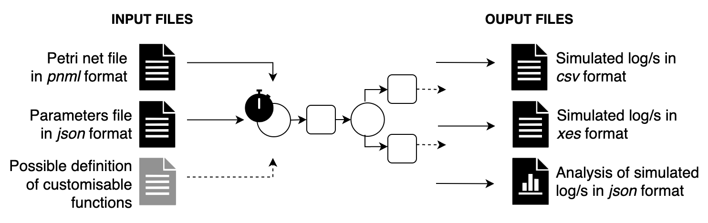

# ${RIMS}{\mathsf{_{Tool}}}$: Runtime Integration of Machine Learning and Simulation for Business Processes

Business Process Simulation represents a powerful instrument for business analysts when analyzing and comparing business processes. 
Most of the state-of-the-art business process simulators, however, rely on Discrete event simulation, which requires various unrealistic assumptions and simplifications to perform experiments. 
Predictive Process Monitoring, on the other hand, offers a viable way to complete ongoing traces or to generate entire traces from scratch, via predictions of the next activities and their attributes. Predictive models, though, are usually based on black-box approaches that makes it difficult to reason on what-if scenarios.
RIMS_tool is a hybrid business process simulator that aims at combining predictive models built from data and Discrete event simulation at runtime in a white-box manner. The proposed tool, thus, is able to exploit the strengths and avoid the limitations of both approaches.




Here to see the full documentation, [RIMS_Tool documentation](https://francescameneghello.github.io/RIMS_tool/index.html)

## Video 

The demonstration video is in *docs/images/* folder or at the following link [video tutorial](https://francescameneghello.github.io/RIMS_tool/index.html#video-tutorial).

## Installation guide

To execute this code, simply install the following main packages:

* scikit-learn==1.2.1
* scipy==1.11.2
* simpy==4.0.1
* pm4py==2.7.5.2
* statsmodels==0.14.0
* pandas==1.5.3

or you can use the configuration file called requirements.txt to install all specified package versions.

```shell
pip install -r requirements.txt
```

Otherwise, with the anaconda system you can create an environment using the environment.yml
specification provided in the repository.

```shell
conda env create -f rims_tool.yml
conda activate rims_tool
```


## Getting Started

Once the packages are installed, <ins>inside the core folder</ins> you can run one or more simulations by specifying the following parameters:

* `-p`: specify the path of the Petri net model to be simulated, in *pnml* format
* `-s`: specify the path to the simulation parameter file, in *json* format
* `-t`: specify the total number of traces per single simulation
* `-i`: specify the total number of simulation to generate
* `-o`: specify the path where to save the output files

```shell
python run_simulation.py -p <petrinet>.pnml -s <simulation_parameters>.json -t 10 -i 1 -o <output_folder_name>
```

Otherwise, it is possible to run the three examples directly with the keywords: *arrivalsD*, *arrivalsS*, *process_times*, *decision_mining*
```shell
python run_simulation.py -e arrivalsD
```


## Input files

As explained in the figure, the tool requires as input files at least: the Petri net model and the json file.

##### Petri net model

RIMS to model and simulate the process utilizes the Petri net model, which is handled through the methods provided by the pm4py library. 
The input file for correct reading needs to be in the format [pnml](https://www.pnml.org/) i.e. *name_file.pnml*. Finally, it must not contain two or more transitions with the same name. 

##### Simulation parameters

As a second input file, the tool requires a json file in which the simulation parameters are specified. The table shows the parameters that must always be present to generate 
a simulation and the optional ones with possible default values.

| Key word of parameters | Optional |                 Default                  | Description                                                                                                                                            |
|:-----------------------|:--------:|:----------------------------------------:|:-------------------------------------------------------------------------------------------------------------------------------------------------------|
| *start_timestamp*      |   True   |              datetime.now()              | Starting date simulation <br/> (%Y-%m-%d %H:%M:%S datetime format).                                                                                    |
| *duration_simulation*  |   True   |                 365 days                 | Total duration of simulation.                                                                                                                          |
| *probability*          |   True   | equal probability for each decison point | Three different possible ways to set which path following for decision point (AUTO, float, CUSTOM), for details see the example *decision_mining*.     |
| *processing_time*      |  False   |                   ----                   | Three different possible ways to set the processing time for each activity (AUTO, DISTRIBUTION, CUSTOM), for details see the example *process times*.  |
| *waiting_time*         |   True   |                   ----                   | Three different possible ways to set the processing time for each activity (AUTO, DISTRIBUTION, CUSTOM), for details see the example *process times*.  |
| *interTriggerTimer*    |  False   |                   ----                   | Two different ways to generate the arrivals times of the next tokens in the simulation (DISTRIBUTION, CUSTOM), for details see the example *arrivals*. |
| *resource*             |  False   |                   ----                   | The list of Roles involved in the simulation, for each of which, individual resources and work schedule are specified (see the example *arrivals*).    |
| *resource_table*       |  False   |                   ----                   | For each activity, it is defined which role is to perform it.                                                                                          |


##### Custom functions

In the file *custom_function.py* it is possible to insert several runtime customizable functions of predictive models to RIMS. 
The next three examples explain how it is possible to define this integration in a simple and quick way.

## Output files

##### Simulated log

At the end of the simulation, the tool returns the simulated log in [XES](https://www.xes-standard.org/) and CSV format with all the features associated
with each event, for details see [custom_function](https://francescameneghello.github.io/RIMS_tool/custom_function.html).

All events generated by the simulation are still printed in the terminal view

##### Analysis of simulated log

Class to generate the output json file *result_simulated_log_(experiment_name).json* with some analysis on the simulated log.

|      Name      | Description                                  |
|:--------------:|:---------------------------------------------|
|  total_events  | Total events in the log                      |
|  total_traces  | Total traces in the log                      |
| *A*_frequency  | Total occurrences of activity *A* in the log |
| total_duration | Total duration of simulation                 |
|   start_date   | Start date of the simulation                 |
|    end_date    | End date of the simulation                   |

If the number of simulations to be run is more than one, RIMS_tool returns the simulated log and analysis file for each simulation.

## Authors

Francesca Meneghello, Chiara Di Francescomarino, Chiara Ghidini

Demo paper *RIMS_tool: a Hybrid Simulator for Business Processes*.
