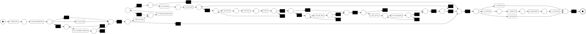
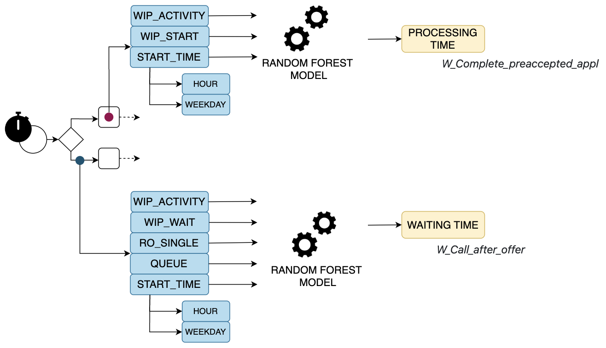

# Example of Process Times of petrinet

For this example, we used the log located in the **example_process_times/synthetic_log.xes** folder.
To generate the synthetic log we define a simulation model inspired by the BPIC2012 process (the log in the other two examples). 
The log contains 4000 traces with 20 different activities.

Let's define the following Petri net model to generate a new simulation.




The aim of this example is to present several ways to set the processing time of each activity and the waiting time between them.

As explained in *custom_function.py* we can apply two methods to define processing and waiting times:

* Distribution function: specify in the json file the distribution with the right parameters for each
activity, see the [numpy_distribution](https://numpy.org/doc/stable/reference/random/generator.html).

```json
"A_FINALIZED": {
    "name": "uniform",
    "parameters": {
        "low": 3600,
        "high": 7200
    }
}
```
* Custom method: a dedicated method can be defined that, given the activity and its features, returns 
  the processing time duration or the needed waiting time. (CUSTOM)
```json
  "processing_time": {
      "A_FINALIZED":  { "name": "custom"}
  }
```

*Be careful*: The simulator raises a WARNING if the distribution produces a negative value as processing/waiting time and instead sets the value to zero.

For this example, two random forests are trained to predict the processing time of the activity *W_Complete_preaccepted_appl* and the waiting time before the activity *W_Call_after_offer*.
The remaining processing times are set with different probability distributions, and the waiting times are undefined, except for the *A_REGISTERED* activity. For the latter, it is assumed that 5
to 10 minutes are required to prepare documentation for registration, which is not included in the processing time. Therefore, the waiting times between the remaining activities are generated only by resource contention.

```json
"waiting_time": {
    "W_Call_after_offer": {
       "name": "custom"
    },
    "A_REGISTERED": {
        "name": "uniform",
        "parameters": {
            "low": 300,
            "high": 600
        }
    }
}
```

The following figure describes the features involved in training the two random forest models. All features except "start_time" are intercase features that RIMS can provide during simulation.
From the code shown, it can be seen that it is simple to predict the prediction at runtime using the intercase features.




* To predict the processing time of the activity *W_Complete_preaccepted_appl* with the following features.

```python
def custom_processing_time(buffer: Buffer):
    input_feature = list()
    input_feature.append(buffer.get_feature("wip_start"))
    input_feature.append(buffer.get_feature("wip_activity"))
    input_feature.append(buffer.get_feature("start_time").weekday())
    input_feature.append(buffer.get_feature("start_time").hour)
    loaded_model = pickle.load(open(os.getcwd()+'/example/example_process_times/processing_time_random_forest.pkl', 'rb'))
    y_pred_f = loaded_model.predict([input_feature])
    return int(y_pred_f[0])
```

* To predict the waiting time before the activity *W_Call_after_offer*
```python
def custom_waiting_time(buffer: Buffer):
    input_feature = list()
    buffer.print_values()
    input_feature.append(buffer.get_feature("wip_wait"))
    input_feature.append(buffer.get_feature("wip_activity"))
    input_feature.append(buffer.get_feature("enabled_time").weekday())
    input_feature.append(buffer.get_feature("enabled_time").hour)
    input_feature.append(buffer.get_feature("ro_single"))
    input_feature.append(buffer.get_feature("queue"))
    loaded_model = pickle.load(
        open(os.getcwd() + '/example/example_process_times/waiting_time_random_forest.pkl', 'rb'))
    y_pred_f = loaded_model.predict([input_feature])
    return int(y_pred_f[0])
```

Riferimento al paper mio come esempio completo di integrazione con modelli piu' complessi
e come e' possibile sfruttare le feature intercase per predirre

To run the example use the following commands:

* to run the example with a exponential distribution
```shell
   python main.py -p ../example/example_decision_mining/bpi2012.pnml -s ../example/example_decision_mining/input_decision_mining_example.json -t 10 -i 1 -o example_decision_mining
```
